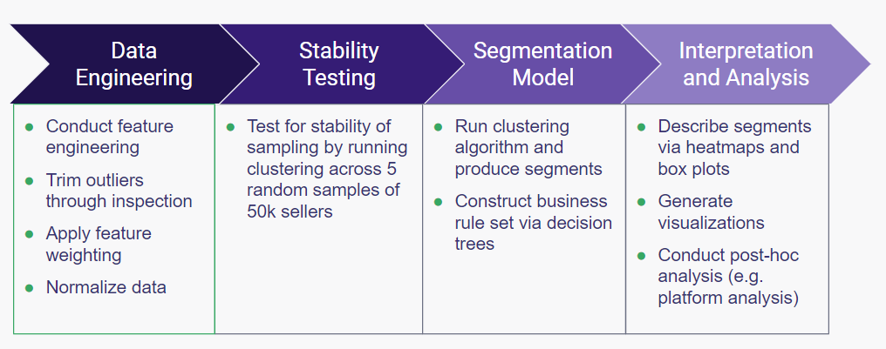
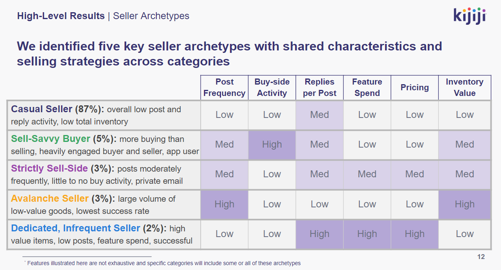

# Kijiji-Seller-Segmentation

Hierarchical segmentation model of Kijiji sellers based on site activity using scikit-learn. A separate clustering was performed on each category to eliminate cross-category confusion and reduce computational load.

Model features:
* Email domain(public or private) 
* Ads posted/day
* Replies sent/day
* Buy:Sell ratio
* % Ads posted per L2 category
* % Replies sent per L2 category
* Avg. ad duration
* Total inventory value
* Avg. price/ad
* Avg. feature spend/ad
* Replies received/ad
* Connections/ad
* Avg. conversation depth

Model pipeline:

Five main seller types were identified across categories:

